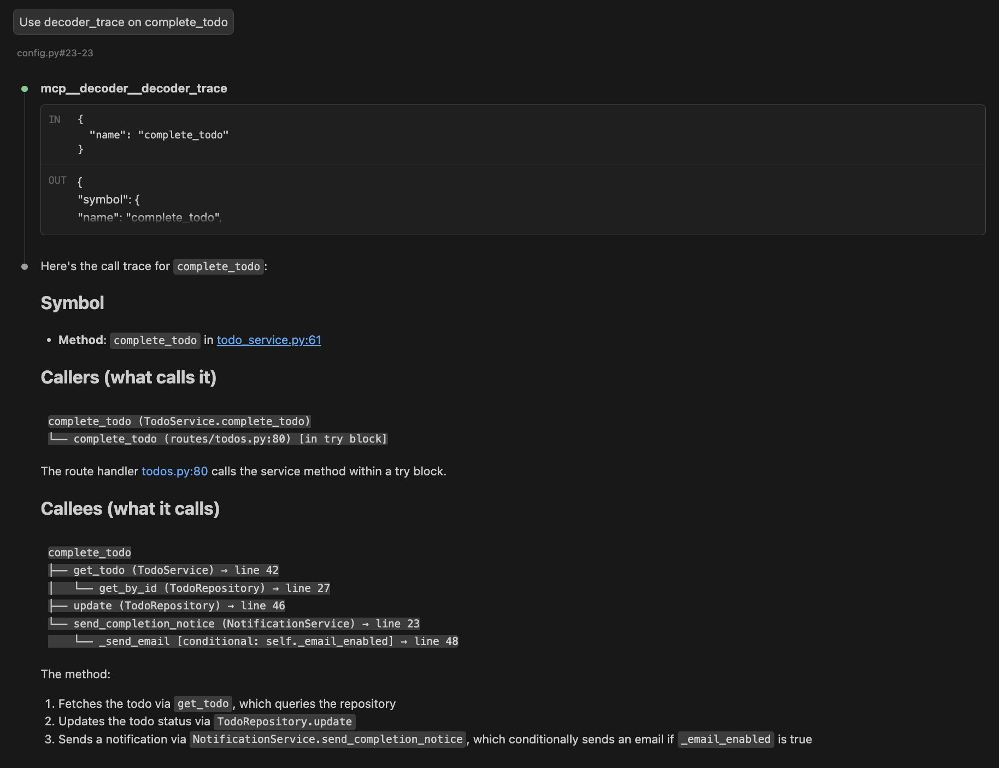
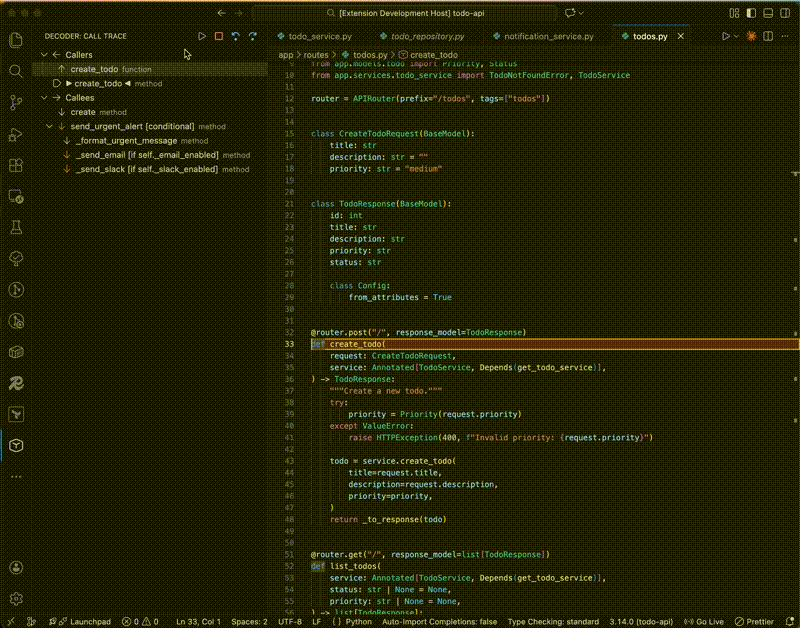

# Decoder: GPS Navigation for Codebases

Inspired by debuggers, decoder is a static call graph analysis tool for Python. It maps how your code connects, tracing those connections from the routing layer to service layer and across the codebase, without the runtime execution a debugger would require.

Unlike grep, which matches text, decoder traces a symbol's call chain and shows what calls it and what it calls. It also tracks conditionals, loops, and try/except blocks, so you see the full nested context of your methods or functions.

Under the hood, decoder parses the Python Abstract Syntax Tree (AST) to generate a relational graph, persisted in a local SQLite index (`.decoder/index.db`).

Interfaces:

- For AI: An MCP server that exposes the codebase's topology, allowing LLMs to perform targeted graph traversals rather than iterative grep and file reads, significantly reducing token consumption and latency

- For engineers: A CLI and VS Code extension that enables interactive trace exploration




VS Code extension coming soon - preview available with manual install

## MCP Server

```bash
cd your-project
pip install mcp-server-decoder
decoder index .
claude mcp add decoder -- mcp-server-decoder
```

Verify it's connected. In Claude, run:

```bash
/mcp
# then, "MCP Status"
```

You should see `decoder` listed with its available tools.

### Tools Available

| Tool | Parameters | Description |
|------|------------|-------------|
| `decoder_callers` | `name` | Find what calls a function |
| `decoder_callees` | `name` | Find what a function calls |
| `decoder_trace` | `name`, `max_depth?` | Trace full call tree |
| `decoder_find` | `query`, `type?` | Search for symbols |
| `decoder_stats` | - | View index statistics |

## CLI

Install:

```bash
pip install decoder-graph
```

Index your codebase:

```bash
decoder index .
```

Trace a function or method in your code:

```bash
decoder trace create_todo
```

Example output:

```
Call tree for create_todo
routes/todos.py:34

Callees:
└─ validate_request [if request.data] routes/todos.py:12
└─ TodoService.create services/todo.py:45
   └─ TodoRepository.save [in try] repositories/todo.py:23
      └─ Session.add db/session.py:67
```

## VS Code Extension (Preview)

Decoder includes a VS Code extension for interactive call graph exploration.
The extension is currently in preview and will be published to the VS Code Marketplace soon.



### Installation (Preview)

Download the `.vsix` from [Releases](https://github.com/maryamtb/decoder/releases), then:

```bash
code --install-extension decoder.vsix
```


### Usage

Before using the extension, index your codebase:

```bash
decoder index .
```

Then in VS Code:

- Right-click any function to:
  - Show Callers
  - Show Callees
  - Trace Call Tree
- Explore call trees in the Decoder sidebar
- Step through execution paths using the Trace Player

### Features

- Show Callers / Callees
- Hierarchical Call Tree View
- Trace Player with Code Highlighting
- Playback Controls (Play, Pause, Step)

### Configuration

```json
{
  "decoder.pythonPath": "python",
  "decoder.playSpeed": 1500
}
```

## Execution Context Detection

Decoder annotates calls with execution context, helping you understand why a call happens.

| Annotation | Meaning |
|------------|---------|
| `[if condition]` | Inside an if/else block |
| `[in loop]` | Inside a for/while loop |
| `[in try]` | Inside a try block |
| `[in except]` | Inside an exception handler |

## Contributing

Contributions are welcome, please see [CONTRIBUTING.md](CONTRIBUTING.md) for guidelines.

## License

MIT
